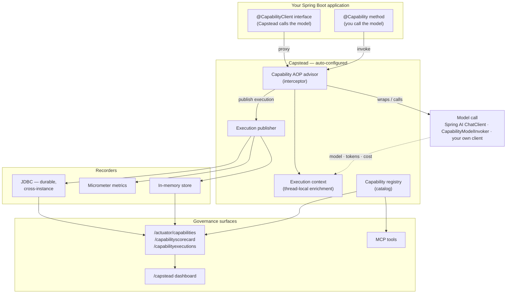

# Capstead

**A Spring Boot capability platform — registry, governance, versioning, and observability for your business capabilities.**

Capstead is **not** another AI framework. It's the governance layer that sits *around* your AI (Spring AI, LangChain4j, or anything else). You keep writing normal Spring Boot methods; Capstead turns them into **governed, discoverable, observable, versioned business capabilities** — with per-capability cost tracking and budgets — from a single annotation.

> Spring AI tells you about one model invocation. Capstead tells you about the **business capability**: how often it ran, which model it used, how many tokens it consumed, how much it cost, whether it succeeded, and which version executed.

---

## Why

Modern apps expose AI capabilities across many services and teams, and nobody can answer: *what capabilities exist, who owns them, what version is live, and what do they cost?* Frameworks like Spring AI and LangChain4j solve **execution** brilliantly. Capstead solves everything **around** execution:

| | Spring AI / LangChain4j | Capstead |
|---|---|---|
| Provider abstraction, structured output, tool calling | ✅ | *reuses them* |
| Capability registry + metadata + **versioning** | ❌ | ✅ |
| `/actuator/capabilities` discovery | ❌ | ✅ |
| First-class execution records + **cost/scorecards** | ❌ (per model-call only) | ✅ |
| Per-model **invocations** + parent-child execution **trees** | ❌ | ✅ |
| **Durable** execution history (JDBC) + `/actuator/capabilityexecutions` | ❌ | ✅ |
| **Daily budgets** & governance | ❌ | ✅ |
| Enforced provider hiding | ❌ | ✅ |
| Export capabilities as **governed MCP tools** | ❌ | ✅ |

---

## Install

```xml
<dependency>
    <groupId>io.capstead</groupId>
    <artifactId>capstead-starter</artifactId>
    <version>0.3.3</version>
</dependency>
```

That's it. Auto-configuration wires everything; no code changes beyond annotating a method.

---

## Quick start

Annotate any Spring bean method:

```java
@Service
class LessonService {

    @Capability(
        name    = "Generate Lesson",
        domain  = "EngineerPrep",
        owner   = "Content Team",
        version = "2",
        tags    = {"lesson", "java"}
    )
    @DailyBudget("$25")
    public Lesson generateLesson(String topic) {
        // your normal logic — call Spring AI, LangChain4j, anything
        return chatClient.prompt().user(topic).call().entity(Lesson.class);
    }
}
```

Now hit the actuator:

```
GET /actuator/capabilities        # the catalog: name, domain, owner, version, tags
GET /actuator/capabilityscorecard # invocations, success rate, latency, tokens, cost
GET /actuator/capabilityexecutions # execution history: ids, parent, per-model invocations
GET /actuator/capabilitymetrics   # Micrometer-backed stats (Prometheus-ready)
```

…and open the dashboard:

```
http://localhost:8080/capstead/
```

Expose the endpoints in `application.yml`:

```yaml
management:
  endpoints:
    web:
      exposure:
        include: capabilities,capabilityscorecard,capabilitymetrics,capabilityexecutions
```

---

## Three ways to declare a capability

Capstead supports **all three** styles — mix and match in the same app.

**1. Annotation** — put `@Capability` on the method (as shown above). Best when you own the code and want the declaration next to it.

**2. Config (YAML)** — declare a capability **without touching the bean**, ideal for third-party or generically-named methods (`generate` / `ask` / `review`), or when you'd rather keep annotations out of your domain code:

```yaml
capstead:
  capabilities:
    - name: "Generate Lesson"
      bean: lessonService        # the Spring bean name
      method: generate           # the method to govern
      domain: Learning
      owner: Content Team
      version: "2"
      tags: [lesson]
      # parameter-types: [java.lang.String]   # only to disambiguate overloaded methods
```

**3. Declarative** — write *no body at all*. Annotate an **interface** method with `@Capability` + `@Prompt`, and Capstead generates the implementation (renders the prompt, routes the model, calls Spring AI, binds the result) — then governs it like any other capability:

```java
@CapabilityClient
@ModelProfile("reasoning")
public interface LessonCapability {

    @Capability(name = "Generate Lesson", domain = "Learning")
    @Prompt("Generate a Java lesson for {{topic}}")
    Lesson execute(String topic);   // no body — Capstead writes it
}
```

Model routing is config-driven via profiles, so capability code never names a model:

```yaml
capstead:
  ai:
    profiles:
      reasoning: { model: us.anthropic.claude-sonnet-4-6, temperature: 0.2 }
```

**Works with any model backend — no Spring AI required.** Capstead calls a single `CapabilityModelInvoker` bean; you supply it (LangChain4j, a provider SDK, a plain HTTP client), or add `capstead-spring-ai` for a default Spring AI `ChatClient` implementation:

```java
@Bean
CapabilityModelInvoker modelInvoker(MyLlmClient llm) {
    return req -> llm.complete(req.model(), req.systemPrompt(), req.userPrompt());
}
```

Full guide: [`docs/DECLARATIVE-CAPABILITIES.md`](docs/DECLARATIVE-CAPABILITIES.md).

If a method is declared **more than one** way, the **annotation wins**. There's also rule-based `capstead.scan` to promote many methods at once by package + name pattern. See a runnable example using every style in [`samples/`](samples/).

---

## Automatic cost tracking

Capstead does **not** measure tokens itself — it *attributes* Spring AI's existing token/model data to the business capability. Add the bridge:

```xml
<dependency>
    <groupId>io.capstead</groupId>
    <artifactId>capstead-spring-ai</artifactId>
    <version>0.5.0</version>
</dependency>
```

Configure per-model pricing (price per million tokens):

```yaml
capstead:
  cost:
    models:
      claude-sonnet:
        input-per-million-tokens: 3.00
        output-per-million-tokens: 15.00
```

Now every capability's scorecard shows real token counts and estimated cost — with **no code in your method**. Once a capability's `@DailyBudget` is reached, further calls are blocked with a `CapabilityBudgetException` until the next day.

> Not using Spring AI? The enrichment seam is open: call
> `CapabilityExecutionContext.recordModelInvocation(model, inputTokens, outputTokens, cost)`
> once per model call, from wherever you make it — Capstead attributes each invocation to the
> capability currently executing on the thread.

---

## Durable execution recorder

Every `@Capability` call becomes a first-class `CapabilityExecution` with a unique id — the atom every scorecard, budget and dashboard is built on. In `0.3.3` the recorder became **durable and structured**:

- **Per-model invocations.** A capability may call the model several times (retries, multi-step, fan-out). Each call is captured as a `ModelInvocation` (model, tokens, cost, timestamp), so cost is attributed *per model* — not just per capability. Token/cost totals are summed across invocations.
- **Execution trees.** When one `@Capability` calls another, the nested execution is linked to its parent automatically (`parentExecutionId`) — an execution tree with no workflow engine.
- **History endpoint.**
  ```
  GET /actuator/capabilityexecutions        # recent executions: id, parent, timing, outcome, invocations
  GET /actuator/capabilityexecutions/{id}   # one execution + its nested capability calls
  ```
- **Recording modes.** `capstead.executions.recording-mode: best-effort` (default — recording never fails your business call) `| sync | async`.
- **Privacy by default.** Inputs/outputs are **not** stored unless you opt in (`capstead.executions.capture-input` / `capture-output`), and a `CapabilityDataRedactor` bean lets you strip secrets/PII. Attribute executions to a caller with a `CapabilityPrincipalProvider`.

### Durable persistence (survives restarts, aggregates across instances)

The in-memory store is bounded and per-instance. Add `capstead-jdbc` to persist every execution (and its model invocations) to Capstead-owned tables:

```xml
<dependency>
    <groupId>io.capstead</groupId>
    <artifactId>capstead-jdbc</artifactId>
    <version>0.3.3</version>
</dependency>
```

```yaml
capstead:
  jdbc:
    enabled: true
    retention-days: 90   # 0 = keep forever
```

Capstead creates its own schema on startup (portable across PostgreSQL and H2), writes each execution and its invocations atomically, and trims old rows on a daily sweep — so scorecards and execution trees survive restarts and aggregate across every instance.

---

## Export capabilities as MCP tools

Capstead can publish your governed capabilities as [Model Context Protocol](https://modelcontextprotocol.io) (MCP) tools — so an MCP client (or an LLM) can discover and call them, while they stay **versioned, owned, and budget-enforced**. Plain MCP tools have none of that governance; Capstead carries it through.

### Transport-agnostic tool model + actuator

```xml
<dependency>
    <groupId>io.capstead</groupId>
    <artifactId>capstead-mcp</artifactId>
    <version>0.3.3</version>
</dependency>
```

Each `@Capability` becomes an MCP tool: a stable `name@version`-derived tool id, a JSON input schema derived from the method signature, and a `governance` block (owner, domain, version, tags). Two actuator surfaces are added:

```
GET  /actuator/capabilitymcp          # tools/list — every capability as an MCP tool
GET  /actuator/capabilitymcp/{name}   # a single tool definition
POST /actuator/capabilitymcp/{name}   # tools/call — body {"arguments": { ... }}
```

Invocations route through the capability's governing proxy, so `@DailyBudget` and execution recording apply exactly as for a direct call.

### Serve over a live MCP server

To expose the tools over a real MCP transport (STDIO, SSE, Streamable-HTTP), add the bridge plus any Spring AI MCP server starter:

```xml
<dependency>
    <groupId>io.capstead</groupId>
    <artifactId>capstead-mcp-server</artifactId>
    <version>0.3.3</version>
</dependency>
<dependency>
    <groupId>org.springframework.ai</groupId>
    <artifactId>spring-ai-starter-mcp-server</artifactId>
</dependency>
```

`capstead-mcp-server` registers a Spring AI `ToolCallbackProvider` built from your capabilities; the MCP server starter discovers it and serves every capability automatically — no per-tool code.

---

## Used in production

Capstead is dogfooded in production at **[engineerprep.io](https://engineerprep.io)** — an AI-powered
technical-interview-prep platform on Spring Boot. It governs about a dozen AI capabilities across two
domains — **EngineerPrep** (lessons, narration, tutoring) and **Academy** (scene & visualization
planning, subtopic & question generation, review, catalog and GitHub-repo generation) — and attributes
token cost per capability across **Anthropic Claude** and **Amazon Nova (Bedrock)**, all visible on the
`/capstead` dashboard, `/actuator/capabilityscorecard`, and `/actuator/capabilityexecutions`.

Most of those are declared **from config, without touching the bean's source** — Capstead can promote an
existing method (even a generically-named `generate` / `ask` / `review`) to a governed capability:

```yaml
capstead:
  capabilities:
    - { name: "Generate Narration", bean: lessonNarrationGenerator, method: generate, domain: EngineerPrep, owner: Content Team, tags: [lesson, narration] }
    - { name: "Lesson Tutor",       bean: lessonTutorService,       method: ask,      domain: EngineerPrep, owner: Content Team, tags: [tutor] }
    - { name: "Review Question",    bean: questionReviewer,         method: review,   domain: Academy,      owner: Content Team, tags: [review] }
```

No annotations, no code edits — each method becomes a governed, scored, budget-enforced capability.
(Prefer annotations? `@Capability` and config-driven declarations coexist; annotations win on conflict.)

---

## Architecture

Capstead wraps every capability with a Spring AOP advisor that turns each call into a first-class,
governed `CapabilityExecution` — then fans it out to recorders and exposes it over actuator, a
dashboard, and MCP. Capstead never executes the model itself; the model call (yours or the one Capstead
generates for a declarative capability) enriches the in-flight execution with model, tokens and cost.



- **Declare** a capability three ways — `@Capability` on a method, config (YAML), or a bodyless
  `@CapabilityClient` interface. All flow through the same advisor.
- **Govern** — the advisor enforces `@DailyBudget`, times the call, and opens a `CapabilityExecution`.
- **Enrich** — whoever calls the model (Spring AI's observation bridge, a `CapabilityModelInvoker`, or
  your client) records model, tokens and cost onto the in-flight execution; nested calls form a tree.
- **Record** — executions fan out to the in-memory store, Micrometer, and (optionally) durable JDBC.
- **Expose** — the registry and recorders back the actuator endpoints, the `/capstead` dashboard, and
  MCP tool export.

---

## Modules

| Module | Purpose |
|---|---|
| `capstead-annotations` | `@Capability`, `@DailyBudget` — dependency-free |
| `capstead-core` | Public model: `CapabilityMetadata`, `CapabilityExecution`, `CapabilityScorecard` |
| `capstead-runtime` | Registry, discovery, execution capture, cost, budgets |
| `capstead-starter` | Spring Boot auto-configuration + actuator endpoints + dashboard + **declarative capabilities** (`@CapabilityClient`, provider-neutral) |
| `capstead-spring-ai` | Optional: token/model attribution from Spring AI observations + a default Spring AI `ChatClient` model invoker for declarative capabilities |
| `capstead-mcp` | Optional: export capabilities as MCP tools + `/actuator/capabilitymcp` |
| `capstead-mcp-server` | Optional: serve capabilities over a live MCP server via Spring AI `ToolCallbackProvider` |
| `capstead-jdbc` | Optional: durable, cross-instance execution + model-invocation persistence with retention |

---

## Design principles

1. **Provider-agnostic** — Capstead never exposes `ChatClient`, model names, or tokens in the capability API. A startup guard rejects any `@Capability` whose signature leaks a provider type.
2. **Business-first** — you think in *Generate Lesson*, *Approve Payment*, not *prompts* and *temperature*.
3. **Convention over configuration** — one annotation exposes a governed capability.
4. **Spring Boot native** — auto-configuration, dependency injection, Actuator, Micrometer.

---

## Status

`0.5.0`. The open-source core is complete and tested: registry, metadata, versioning, discovery, first-class executions with **per-model invocations and parent-child execution trees**, cost estimation, daily budgets, actuator endpoints (catalog, scorecard, metrics, **execution history**), a dashboard, the Spring AI bridge, **provider-neutral declarative capabilities** (`@CapabilityClient` — works with any model backend via a `CapabilityModelInvoker`), MCP export (tool model, actuator, and Spring AI MCP server bridge), and an optional **JDBC recorder** for durable, cross-instance history with retention.

## License

Apache License 2.0.
